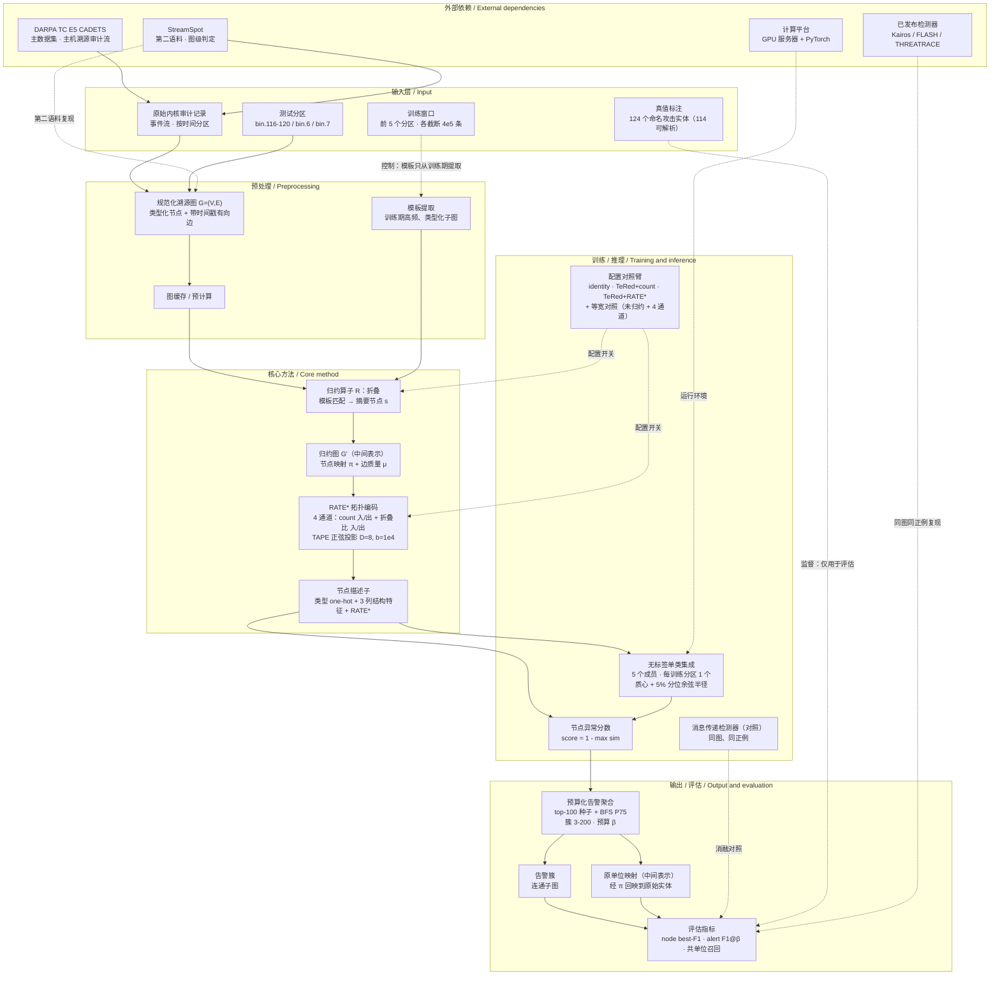
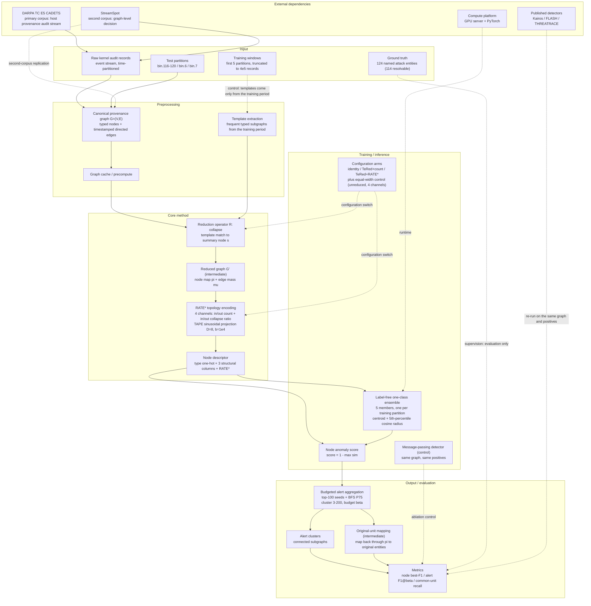

# RATE 系统框图（中文 + English）

本目录包含论文 *Reduction-Aware Topology Encoding: The Cost of Provenance Graph
Reduction for Topology-Aware Detection Is an Encoding Problem* 的系统框图。

- `RATE系统框图_中文.mmd`：中文 Mermaid 源码
- `RATE_system_diagram_EN.mmd`：English Mermaid source
- `RATE系统框图_中文.png`：中文 PNG 渲染（已通过 mermaid.ink 在线生成）
- `RATE_system_diagram_EN.png`：English PNG render

> 图例：实线箭头 = 数据流；虚线箭头 = 控制流 / 监督信号 / 可选关系。

---

## 1. 中文版本

---

## 2. English version

---

## 3. 关键路径与设计点（Key paths and design points）

1. **编码决定检测，归约只是压缩。**
   主数据流（实线）沿“原始审计记录 → 规范化溯源图 → 归约图 G' → RATE* 描述子 → 无标签单类集成 → 预算化告警聚合”传递。论文的核心发现是：去掉拓扑通道后，归约图与未归约图同样不可检测（node F1 约 0.007 vs 0.005），说明检测能力由编码保证，归约本身并不破坏拓扑信号。

2. **归约与编码解耦：R 负责压缩，RATE* 负责可读。**
   `归约算子 R` 仅做模板匹配与折叠，输出节点映射 π 和边质量 μ；`RATE*` 再用 4 通道（in/out 边数 + in/out 折叠比）与 TAPE 正弦投影，重建被移动或删除的度信息。二者可独立替换：RATE* 在 μ≡1 时退化为普通度编码，保证同一套编码同时服务归约图与未归约图。

3. **训练控制与真值监督严格分离。**
   训练窗口（虚线）只用于提取模板和无标签单类集成；真值标注（虚线）仅在评估阶段使用。这种分离保证 detector 不会接触攻击标签，避免标签泄露，同时也承认训练窗口并非“无攻击”的假设局限。

4. **原单位映射让归约与未归约公平可比。**
   告警簇通过 π 映射回原始实体（`原单位映射`），得到共单位召回（common-unit recall）。只有在这个单位下，identity、TeRed+count、TeRed+RATE* 以及等宽对照的比较才有意义；否则归约图因标签继承而人为扩大正例集合。

5. **外部依赖全部以“对照”方式接入，不混入主路径。**
   StreamSpot 作为第二语料复现输入 / 预处理链路；已发布检测器 Kairos / FLASH / THREATRACE 和消息传递检测器均以同图、同正例方式接入评估指标。它们被画在“外部依赖”层，用虚线指向评估节点，避免污染主数据流。
